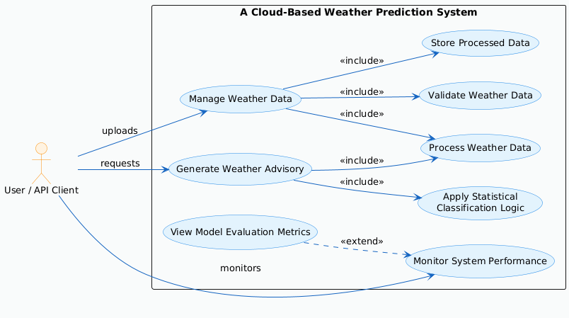
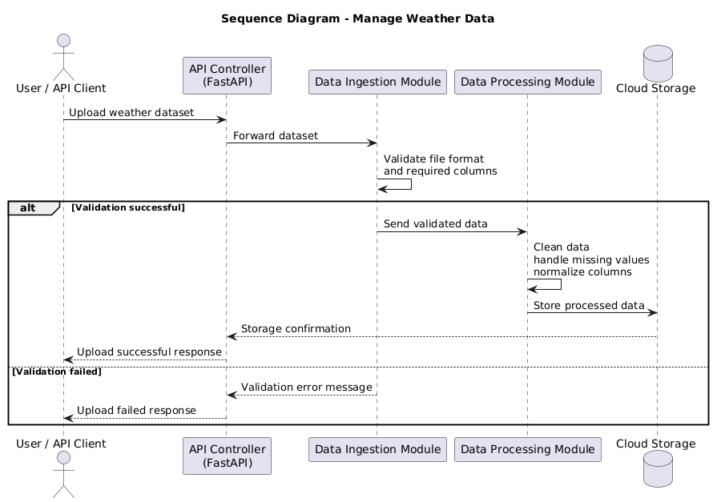
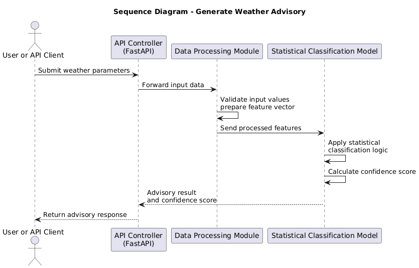
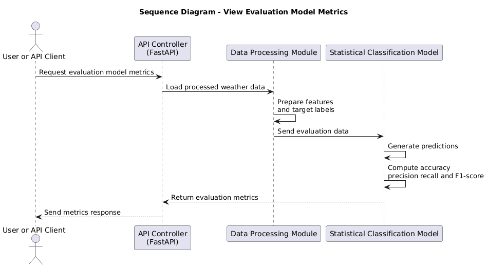
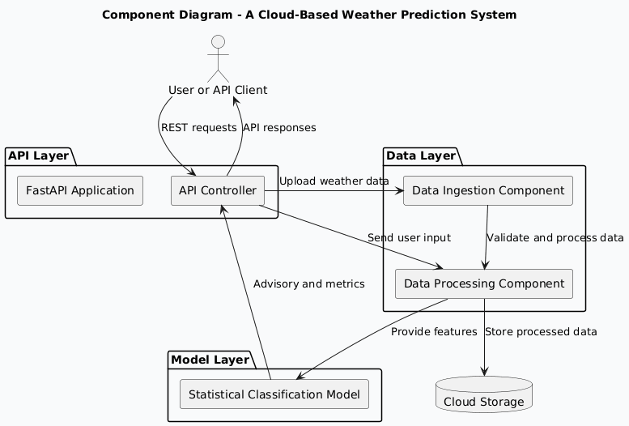

A Cloud-Based Weather Temperature Analysis System

Student Name :Dina Khadka

Github  Repo :- https://github.com/dina937/Cloud-Based-Weather-Temperature-Analysis-Project

1.Project Defination:-

This project presents a cloud-based weather advisory system that analyzes meteorological parameters such as temperature, humidity, wind speed, and pressure to determine whether outdoor activity is advisable. A lightweight statistical classification model is trained on historical weather data to generate multi-level advisory outputs along with confidence scores. The system is deployed using a FastAPI-based cloud architecture to support real-time user interaction.
Existing weather systems often focus on numerical forecasts that may not directly support user decision-making. This project addresses that limitation by providing a decision-oriented weather advisory system that transforms raw meteorological data into actionable guidance.
The project investigates the use of simple statistical models deployed through modern cloud technologies to demonstrate efficient, interpretable, and energy-aware temperature analysis while maintaining architectural clarity and low computational overhead.

Scope of the Project:-

This project focuses on the end-to-end processing of historical weather data within a cloud-native environment. It covers data ingestion, preprocessing, advisory label generation, statistical classification and the delivery of results through a RESTful API.
The system transforms key meteorological parameters temperature, humidity, wind speed and pressure into decision-oriented weather advisories rather than performing precise numerical forecasting. A lightweight statistical classification model is used to generate multi-level advisory outputs along with confidence scores.
The scope deliberately avoids complex or computationally intensive machine learning techniques and instead emphasizes core cloud-computing concepts, modular system architecture, model interpretability, basic performance evaluation and sustainable, low-resource deployment.

2.Architecture Designs and ADRs:- 

The system is designed as a simple, cloud-native pipeline that processes historical temperature data in a structured and efficient manner. Data ingestion, storage, processing and prediction are clearly separated to ensure modularity and maintainability. Lightweight statistical prediction logic is used to minimize computational overhead, and results are exposed through a RESTful API to support easy integration and scalability.
Architecture Flow:

Data Ingestion → Cloud Storage → Data Preprocessing → Statistical Classification Logic → REST API

ADRs ( Architecture Decision Records):-

Architecture Decision Records are short documents that capture important architectural decisions, including the context, the decision made, and its consequences. The following Architecture Decision Records (ADRs) document the key architectural choices made during the design of the system. Each ADR captures the context, the decision taken, and its implications, providing traceability between design goals and system implementation.

•	ADR-001: Choice of Simple Statistical Forecasting Models

(Context → Decision → Rationale → Consequences)

Context

The project aims to analyze historical weather data and provide user-oriented advisory outcomes while maintaining low computational overhead architectural clarity and energy efficiency.

Decision

The system uses a lightweight statistical classification model to generate multi-level weather advisory outputs based on processed meteorological features.

Rationale

The selected approach supports interpretable decision logic requires minimal training overhead and is suitable for real-time cloud deployment. Compared to advanced forecasting models statistical classification provides sufficient decision accuracy while maintaining simplicity and sustainability.

Consequences

The system does not produce precise numerical forecasts but instead delivers advisory-level outputs. This design choice improves usability interpretability and resource efficiency while aligning with the project’s educational and sustainability objectives.

ADR-002: Modular Pipeline-Based Architecture

(Context → Decision → Rationale → Consequences)

Context

The system requires clear separation between data ingestion, processing, prediction, and API exposure in a cloud environment.

Decision

The system adopts a modular pipeline architecture, with distinct components for ingestion, processing, prediction, and REST API access.

Rationale

This approach improves maintainability, traceability between design and code and supports containerized deployment.

Consequences

The architecture introduces minimal coordination between modules but results in a clean, maintainable, and extensible system.
ADR-002: Use of FastAPI and Modular Serve Architecture

Context

The system requires a lightweight and structured interface to deliver weather advisory predictions in a cloud-based environment.

Decision

FastAPI is used as the RESTful interface, and the system is designed using a modular architecture that separates data ingestion, feature processing, prediction, and monitoring components.

Rationale

FastAPI provides high performance with low overhead, while modular design improves maintainability, clarity, and alignment between architecture and implementation.
Consequences
This approach ensures scalable, maintainable, and efficient deployment of the weather advisory system with minimal architectural complexity.

3.1 UML Use-Case Diagram

The following use-case diagram illustrates how external actors interact with the system and outlines the core functional capabilities provided by the System.

   
Fig3.1:-Usecasediagram-Weather Temperature Prediction System

Explanation
• Illustrates how external actors interact with the system at a functional level.
• Identifies two primary actors:
o User or API Client – uploads weather data requests advisory predictions and views results
o Monitoring User – checks system status and model evaluation metrics
• Defines three core system use cases:
o Manage Weather Data – upload validate process and store historical weather data
o Generate Weather Advisory – analyze meteorological parameters and produce advisory results with confidence scores
o Monitor System Performance – view system status and model evaluation metrics
• Focuses on what the system provides to each actor rather than how internal processing is implemented.
• Supports requirements analysis by mapping system functionality to actor-specific objectives.
• Provides a high-level and easily understandable representation of system behavior for developers and reviewers.

3.2 Sequence Diagram – 

A.ManageWeather Data
This sequence diagram illustrates the interaction flow for loading historical weather data into the system.

FigureA:- Sequence Diagram – Manage Weather Data

Explanation:-
•	The User or API Client submits a request to upload a historical weather dataset to the system.
•	 The FastAPI controller receives the request and coordinates the data handling process.
•	The data ingestion module validates the dataset structure and checks required attributes.
•	 The data processing module cleans transforms and standardizes the weather data for analysis.
•	The processed dataset is securely stored in cloud storage for subsequent advisory generation.
•	The system returns a success or failure response to the User or API Client based on the processing outcome.

B.Generate Weather Advisory
This sequence diagram illustrates how user-provided weather inputs are processed and classified to generate advisory results with confidence scores.

Figure B: Sequence Diagram – Generate Weather Advisory

Explanation:
• The User or API Client submits weather parameters to request an advisory.
• The FastAPI controller receives the request and forwards the data for processing.
• The data processing module validates and prepares the input features.
• The statistical classification model generates the advisory result and confidence score.
• The advisory response is returned to the User or API Client.

C.View Evaluation Model Metrics
This sequence diagram illustrates how the system computes and presents evaluation metrics for the trained statistical classification model

.Figure C: Sequence Diagram – View Evaluation Model Metrics

Explanation:
•	The User or API Client requests evaluation metrics for the trained model.
•	 The FastAPI controller receives the request and triggers the evaluation process.
•	The system prepares the required features and target labels from processed weather data.
•	 The statistical classification model computes accuracy precision recall and F1-score.
•	The evaluation metrics are returned to the User or API Client.

3.3 Component Diagram:

Fig 2.3: Component diagram

Explanation
• The API Controller built using FastAPI acts as the primary entry point for all external user and API client requests.
• The Data Ingestion component is responsible for validating and ingesting historical weather datasets uploaded in CSV format.
• The Data Processing component cleans transforms and prepares meteorological parameters for advisory generation.
• The Statistical Classification Model component applies lightweight statistical logic to generate weather advisory outcomes along with confidence scores.
• The Cloud Storage component manages persistent storage of uploaded and processed weather data.
• The system exposes monitoring functionality through dedicated API endpoints to provide system status and model evaluation metrics.

4. Implementing Quality and Modularity
   
•	Each functional responsibility is implemented as an independent module including data ingestion data preprocessing statistical classification logic and API handling.
•	Modular design reduces interdependencies between components and improves system readability maintainability and extensibility.
•	Well-defined interfaces are maintained between modules to ensure clear data flow and separation of concerns.
•	Input validation is applied during dataset ingestion to ensure data consistency integrity and quality.
•	Consistent error handling and response mechanisms are implemented to support reliable system behavior.
•	The overall implementation remains lightweight scalable and fully aligned with the defined cloud-based architecture.

5.CI/CD and operation Practices

•	The project follows a lightweight CI/CD approach to support reliable development testing and deployment.
•	Source code and configuration files are maintained in a version-controlled repository to ensure traceability and collaboration.
•	Basic automated checks are used to verify application startup and validate the structure of uploaded weather datasets.
•	 The CI process focuses on core system functionality including data ingestion advisory generation and model evaluation logic.
•	Containerized deployment is used to ensure consistent execution across different environments.
•	The system is designed for simple operation using container-based execution without complex orchestration.
•	 A system status endpoint and basic logging mechanisms are provided to support runtime monitoring and error visibility.
•	This approach enables reproducible cloud deployment while keeping operational complexity low.These practices enable reliable day-to-day operation while keeping operational complexity low.

6.Observability,Monitoring and SLOS

•	Observability is provided through dedicated system status and evaluation endpoints exposed via the REST API.
•	These interfaces allow users to verify application availability operational state and basic model performance.
•	Basic logging captures key system events including data ingestion advisory requests evaluation requests and error conditions.
•	Logging supports visibility into system behavior while remaining decoupled from core data processing and classification logic.
•	Service level objectives are defined at a foundational level with emphasis on correct request handling and consistent advisory responses.
•	Reliable API availability under normal operating conditions is treated as the primary service objective.
•	The defined objectives align with the lightweight low-compute and sustainable design principles of the system.

6.Sustainability ans Carbon Awarness

•	The system is designed to minimize computational overhead and overall energy consumption.
• Weather advisory generation relies on lightweight statistical classification logic rather than resource-intensive machine learning models.
• CPU-only execution and simple feature-based classification reduce computational cost and energy usage.
• On-demand processing ensures that computation is performed only when user requests are received.
• Carbon-aware considerations are addressed conceptually by favoring simple and efficient classification logic under constrained resources.
• During periods of higher system load the model operates using minimal computational complexity to preserve system stability.
• The design explicitly acknowledges the trade-off between advisory accuracy and computational efficiency while prioritizing sustainable cloud operation.
7. Technology Stack (Minimal)
•	Programming Language: Python 3
•	Libraries: Pandas, NumPy
•	API Framework: FastAPI
•	Application Server: Uvicorn
•	Infrastructure: Cloud object storage and containerized deployment (conceptual)
•	Documentation & Diagrams: Markdown, Draw.io

 Application Scaffolding:-
A Cloud-Based Weather Temperature Analysis System
Cloud-Based-Weather-Temperature-Analysis-Project/
│
├── README.md
├── requirements.txt
├── .gitignore
├── data/
│   ├── input/
│   │   └── weather_data.csv
│   └── output/
│       └── results.json
│
├── src/
│   ├── __init__.py
│   ├── main.py
│   ├── ingest.py
│   ├── process.py
│   └── predict.py
│
├── docs/
│   ├── usecase.png
│   ├── component.png
│   └── sequence/
│       ├── sequence1.png
│       ├── sequence2.png
│       └── sequence3.png
│
└── kubernetes/
    ├── deployment.yaml
    └── service.yaml
